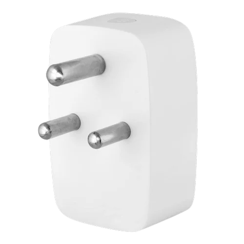

# EnergyIQ - Smart Energy Monitoring System

<p align="center">
  
</p>

## Overview

EnergyIQ is a comprehensive mobile application built with React Native and Expo that helps users monitor and manage their energy consumption through smart plugs. The app provides real-time power usage data, cost analysis, and device control features.

## Features

### Real-time Monitoring
- Live power consumption tracking
- Current, voltage, and energy measurements
- Real-time device status updates

### Energy Analytics
- Daily, weekly, and monthly usage graphs
- Cost breakdown analysis
- Energy consumption patterns
- Billing amount calculations

### Device Management
- Multiple device support
- Custom device naming
- Location and appliance categorization 
- Remote power control

### Smart Features
- Timer scheduling
- Usage alerts
- Power state toggling
- Device status monitoring

## Screenshots

<div align="center">
  <p float="left">
    &nbsp;&nbsp;
    
    
    &nbsp;&nbsp;
    &nbsp;&nbsp;
    &nbsp;&nbsp;
    &nbsp;&nbsp;
  </p>
</div>

> **Note**: From left to right: Login interface, Dashboard view, Device Details panel, and Profile screen


## Technology Stack

- **Frontend**: React Native, Expo
- **Backend**: Firebase (Authentication, Realtime Database, Firestore)
- **UI Components**: 
  - React Native Gifted Charts
  - React Native Linear Gradient
  - React Native Animatable
- **Navigation**: React Navigation v6
- **State Management**: React Context API
- **Authentication**: Firebase Auth

## Installation

1. Clone the repository:
```bash
git clone https://github.com/yourusername/SmartPlug.git
```

2. Install dependencies:
```bash
cd SmartPlug
npm install
```

3. Create a `.env` file in the root directory with your Firebase configuration:
```
FIREBASE_API_KEY=your_api_key
FIREBASE_AUTH_DOMAIN=your_auth_domain
FIREBASE_PROJECT_ID=your_project_id
FIREBASE_STORAGE_BUCKET=your_storage_bucket
FIREBASE_MESSAGING_SENDER_ID=your_sender_id
FIREBASE_APP_ID=your_app_id
FIREBASE_DATABASE_URL=your_database_url
```

4. Start the development server:
```bash
npm start
```

## Project Structure

```
src/
├── components/    # Reusable UI components
├── context/       # React Context providers
├── hooks/         # Custom React hooks
├── navigation/    # Navigation configuration
├── screens/       # App screens/pages
├── styles/        # Stylesheet definitions
└── utils/         # Helper functions and types
```

## Contributing

1. Fork the repository
2. Create your feature branch (`git checkout -b feature/AmazingFeature`)
3. Commit your changes (`git commit -m 'Add some AmazingFeature'`)
4. Push to the branch (`git push origin feature/AmazingFeature`)
5. Open a Pull Request

## Contact

Twitter - [kapil619](https://x.com/kapil_badokar)

Project Link: [https://github.com/kapil619/SmartPlug](https://github.com/Kapil619/SmartPlug)
